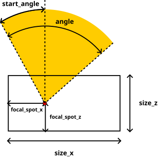
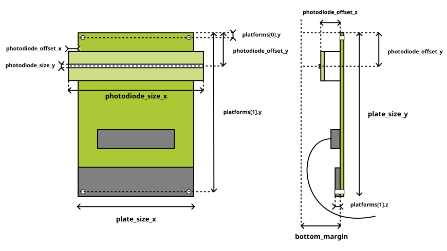
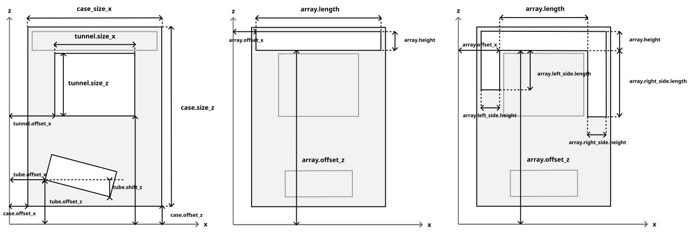

# XArray Constructor

A calculator that simplifies the design of X-ray baggage scanner geometry.  
It allows you to parameterize the X-ray tube, detector cards, and the scanning plane structure, including the detector array.  
The program outputs the precise positions of detectors within the array, along with the coordinates of their mounting platforms.  
Using this data, you can design a detector array that enables your scanner to produce geometrically flawless images.

## Installation:
```
git clone https://github.com/kdmitruk/xarray_constructor.git
cd xarray_constructor
pip install -r requirements.txt
```

## How to use:
Prepare configuration files for the X-ray tube and detector card.  
Run the program with the path to your scanner configuration file:
```
python arr_constructor.py scanners/scanner_name.json
```
If you want to create a new scanner configuration, the best way is to modify an existing scanner file.  
All scanner parameters can be adjusted through the graphical interface.  
A realtime scanner visualization is displayed, allowing you to verify the layout interactively.
Detector card and X-ray tube details can only be modified by editing their respective files, as they are not meant to change frequently.  
All device description files use the JSON format.

### Tube file


The X-ray tube file describes its dimensions and the position of the focal spot inside the tube.  
The tube emits fan-shaped radiation whose angular range is parameterized.  
To maintain consistency with the technical drawings typically used by tube manufacturers, it is assumed that zero degrees corresponds to the vertical (Z-axis) direction.  
Angles are measured in degrees.

Tube configuration files are located in the `tubes` directory.

| parameter      | description                                                                                                                                          |
|----------------|------------------------------------------------------------------------------------------------------------------------------------------------------|
| `size_x`       | Tube case width                                                                                                                                              |
| `size_z`       | Tube case height                                                                                                                                             |
| `focal_spot_x` | Distance from the left border of the tube case to the center of the focal spot                                                                               |
| `focal_spot_z` | Distance from the bottom border of the tube case to the center of the focal spot                                                                             |
| `start_angle`  | Left boundary angle of the radiation fan. Use negative values for counterclockwise angles. |
| `angle`        | Total clockwise angle of the radiation fan, starting from the `start_angle`                                            |

### Detector card file


The detector card file describes a single building block of the detector array.  
The starting point is defining the dimensions of the PCB (printed circuit board) on which the card is built.  
The position and dimensions of the photodiode, which registers radiation, are defined relative to the PCB.  

The list of platforms defines where in 3D space the supports for the detector card are placed.  
The bottom margin shifts the photodiode upward from the array base, leaving space for components such as cables.

Detector card files are located in the `cards` directory.


| parameter             | description                                                                                                                            |
|-----------------------|----------------------------------------------------------------------------------------------------------------------------------------|
| `plate_size_x`        | Width of the detector card                                                                                                             |
| `plate_size_y`        | Length of the detector card                                                                                                            |
| `photodiode_offset_x` | Distance from the left edge of the detector card to the photodiode                                                                     |
| `photodiode_offset_y` | Distance from the top (Y-axis) edge of the detector card to the **center** of the photodiode                                           |
| `photodiode_offset_z` | Distance from the bottom (Z-axis) edge of the detector card to the **bottom** of the photodiode                                        |
| `photodiode_size_x`   | Length of the photodiode                                                                                                               |
| `photodiode_size_y`   | Width of the photodiode                                                                                                                |
| `bottom_margin`       | Margin between the bottom of the photodiode and the bottom of the array. Useful if the detector card includes cables or other elements below the photodiode. |
| **platforms**         | List of supporting platform positions. Each entry specifies:                                                                           |
| `platforms[].y`       | Position along the length of the detector card (measured from the top edge)                                                            |
| `platforms[].z`       | Height of the platform relative to the bottom of the detector card. Use this if platforms have different heights.                      |

### Scanner file


The scanner file describes the relative positions of all scanner components.  
The reference point for most dimensions is position (0, 0).  

The tube and detector card models are referenced by file names from their respective directories (without .json).  
The tube can be tilted using the `tube.shift_z` parameter.  

The program assumes that the tube is positioned below the tunnel, while the detector array surrounds the tunnel on one to three other sides.  
The case and tunnel allow for visual assessment of element positions but do not affect calculations.

Scanner configuration files are located in the `scanners` directory.

| parameter                   | description                                                                                                                       |
|-----------------------------|-----------------------------------------------------------------------------------------------------------------------------------|
| **array**                   | Parameters of the detector array                                                                                                  |
| `array.mode`                | Array configuration mode. Options: `compact` or `arc`. Arc mode disables the left and right arms of the array.                    |
| `array.offset_x`            | Horizontal offset of the array                                                                                                    |
| `array.offset_z`            | Vertical offset of the array                                                                                                      |
| `array.length`              | Length of the top part of the detector array                                                                                      |
| `array.height`              | Height of the top part of the detector array                                                                                      |
| `array.bottom_thickness`    | Thickness of the array’s bottom plate. Used as an additional placement margin for detector cards.                                 |
| `array.initial_card_offset` | Offset of the first detector card. Use for fine-tuning the card alignment. **Do not exceed the width of a single detector card.** |
| **array.left_side**         | Parameters of the detector array’s left arm                                                                                       |
| `array.left_side.enabled`   | Whether the array’s left arm is present                                                                                           |
| `array.left_side.length`    | Length of the array’s left arm                                                                                                    |
| `array.left_side.height`    | Height of the array’s left arm                                                                                                    |
| **array.right_side**        | Parameters of the detector array’s right arm                                                                                      |
| `array.right_side.enabled`  | Whether the array’s right arm is present                                                                                          |
| `array.right_side.length`   | Length of the array’s right arm                                                                                                   |
| `array.right_side.height`   | Height of the array’s right arm                                                                                                   |
| **tube**                    | X-ray tube parameters                                                                                                             |
| `tube.model`                | Model of the X-ray tube. Use the name of a file from the `tubes` directory                                                        |
| `tube.offset_x`             | Horizontal offset of the tube’s bottom-left corner                                                                                |
| `tube.offset_z`             | Vertical offset of the tube’s bottom-left corner                                                                                  |
| `tube.shift_z`              | Vertical offset of the tube’s bottom-right corner relative to its bottom-left corner                                              |
| **card**                    | Detector card parameters                                                                                                          |
| `card.model`                | Model of the detector card. Use the name of a file from the `cards` directory                                                     |
| **tunnel**                  | Scanner tunnel parameters                                                                                                         |
| `tunnel.offset_x`           | Horizontal offset of the tunnel                                                                                                   |
| `tunnel.offset_z`           | Vertical offset of the tunnel                                                                                                     |
| `tunnel.size_x`             | Width of the tunnel                                                                                                               |
| `tunnel.size_z`             | Height of the tunnel                                                                                                              |
| **case**                    | Protective casing parameters                                                                                                      |
| `case.offset_x`             | Horizontal offset of the case                                                                                                     |
| `case.offset_z`             | Vertical offset of the case                                                                                                       |
| `case.size_x`               | Width of the case                                                                                                                 |
| `case.size_z`               | Height of the case                                                                                                                |

## Output:
The application allows exporting the results of its calculations as a JSON file,
which includes the locations of the platforms supporting the detector card, as well as the positions of the photodiodes.
It is also possible to generate a scene file for the simulation, which is described [here](simulation/README.md).

## License
This project is licensed under the GPLv3 License.  
See the [LICENSE](LICENSE) file for details.

## Author
Developed by Krzysztof Dmitruk.
